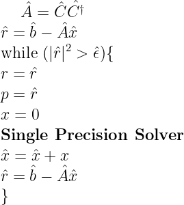
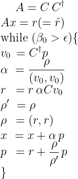

# Solving Laplacian Problem using CG Solver with Mixed Precision

<table>
<tr> <th width = '40'> Double Precision Solver </th> 
  <th width = '40'> Single Precision Solver </th></tr>
<tr> 
<td>  </td>
<td> </td>
</tr>
</table>

