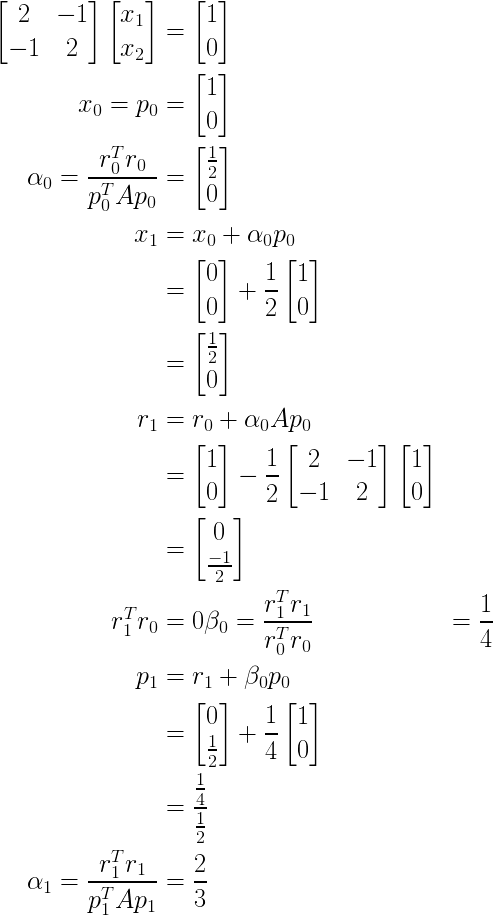
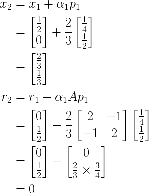

# Hybrid-Precision Analysis on Conjugate-Gradient Solvers (H.A.C.S)

### May 04, 2019: ###
This repository is currently further under development

This project compares the computation speed and performance (FLOPS) of a Conjugate Gradient (CG) Method using double and mixed computing precision.
### July 14, 2019: ###
Worked examples:  

 

